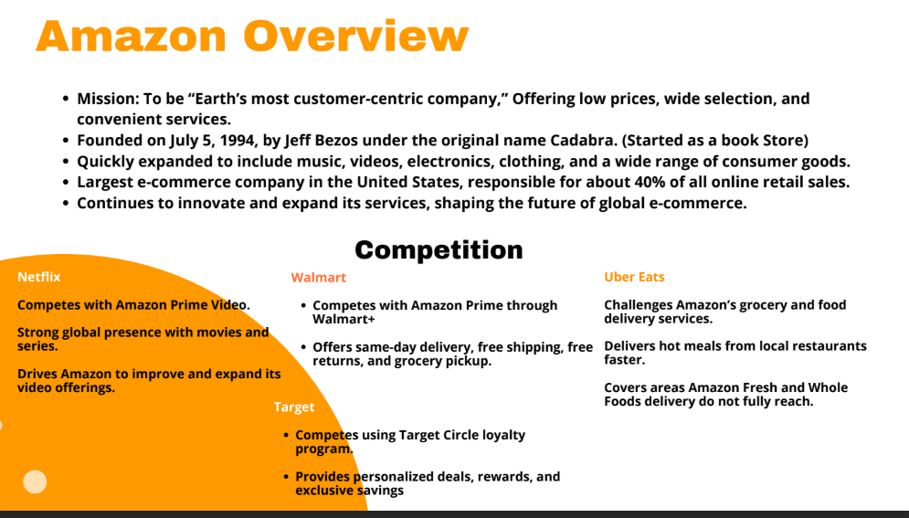
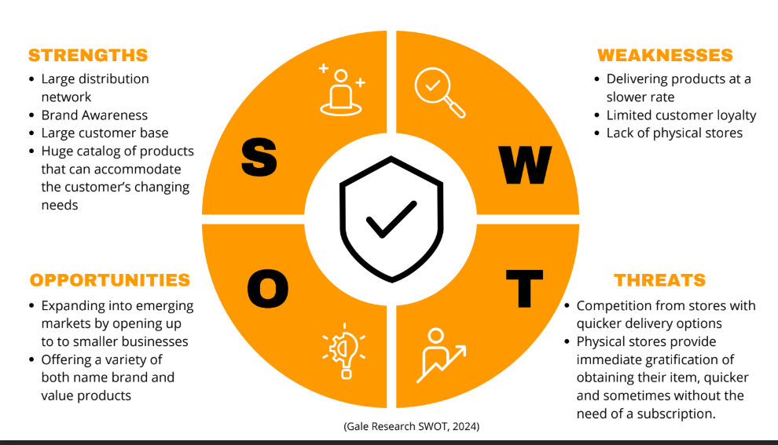
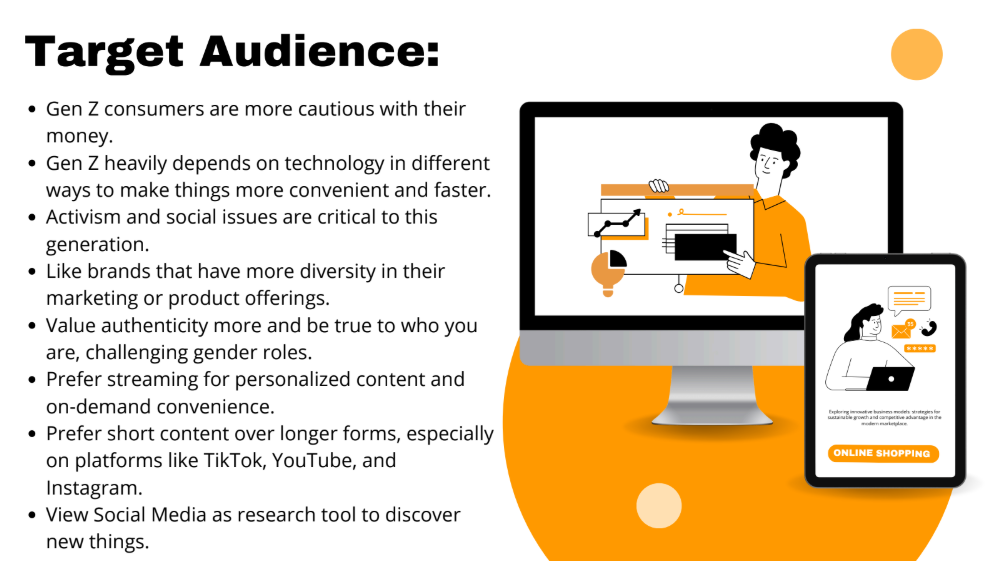
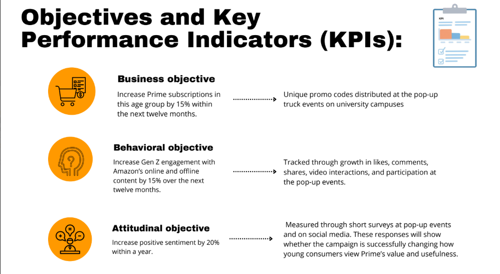
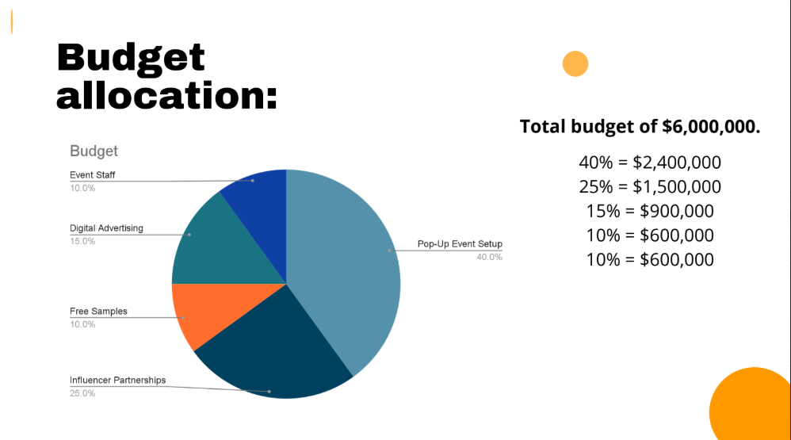
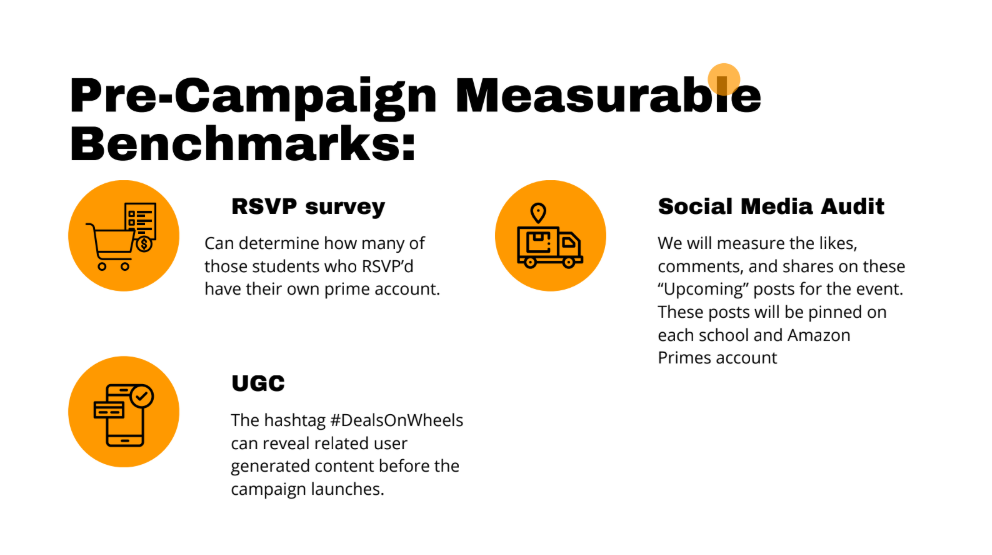

# 🛒 Amazon Deals on Wheels — Market Planning & Strategy
> *Marketing Strategy | Campaign Planning | Consumer Research | KPI Development*

Developed a full-scale experiential marketing campaign for Amazon Prime targeting Gen Z college students. Led strategy on a mobile pop-up truck concept touring 6 university campuses nationwide — Harvard, Notre Dame, University of Michigan, Stanford, UT Austin, and University of Florida. The campaign ran September through March (skipping January for winter recess) with a 12-month overlapping cycle structure. Conducted primary research (n=50), which found that 70% of respondents agreed pop-up events are more engaging than traditional ads and 60% cited price as a top purchasing factor. Defined business, behavioral, and attitudinal KPIs and built a $6,000,000 budget allocation framework with measurable pre- and post-campaign benchmarks tracked through RSVP surveys, QR code affiliate codes, and satisfaction follow-ups.

---

## 📌 Key Highlights
- Proposed Amazon Prime mobile pop-up truck touring 6 college campuses over 12 months
- Primary research (n=50): 52% agreed pop-up events outperform traditional advertising
- Business objective: increase Gen Z Prime subscriptions by 15% within one year
- $6M budget split: 40% event setup, 25% influencer partnerships, 15% digital advertising, 10% free samples, 10% event staff
- Three-survey measurement framework: RSVP (pre), QR code (during), satisfaction (post-5 months)
- Campaign hashtag: #DealsOnWheels

---

## 📄 Full Presentation
[Download Full Slide Deck (PDF)](Amazon_Deals_on_Wheels.pdf)

---

## 🖼️ Project Slides

---

## 👥 Contributors
- **Britnee Bayas**
- Assiya Ba
- Elizabeth Chester
- Kristine Dziedziula
- Madison Forsaith
